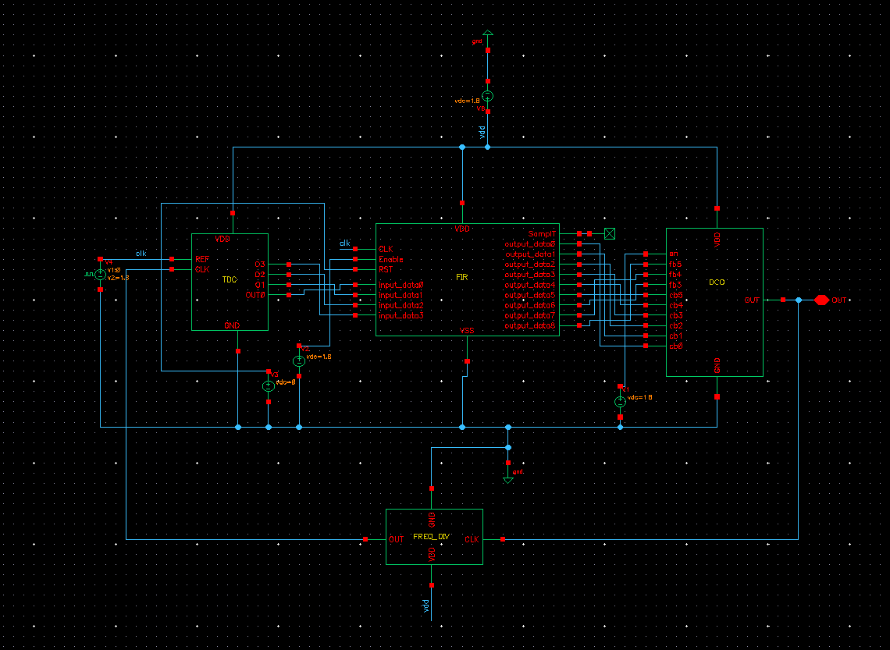
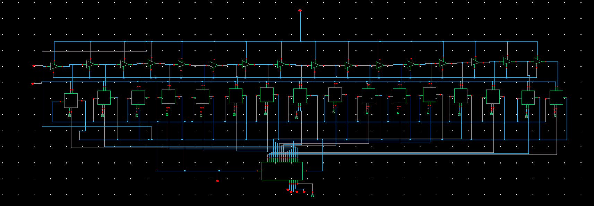
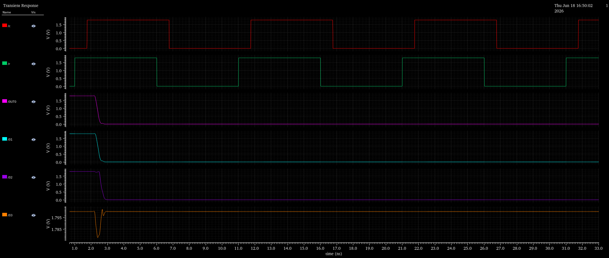
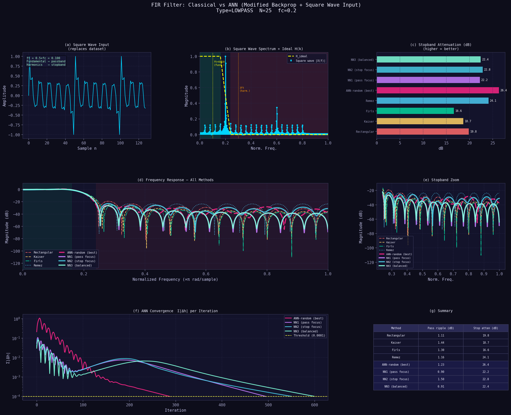
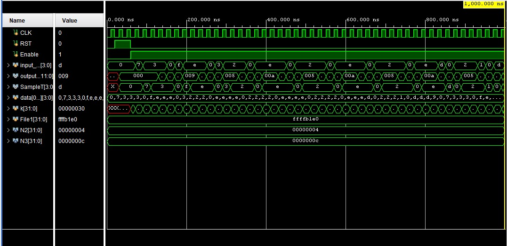
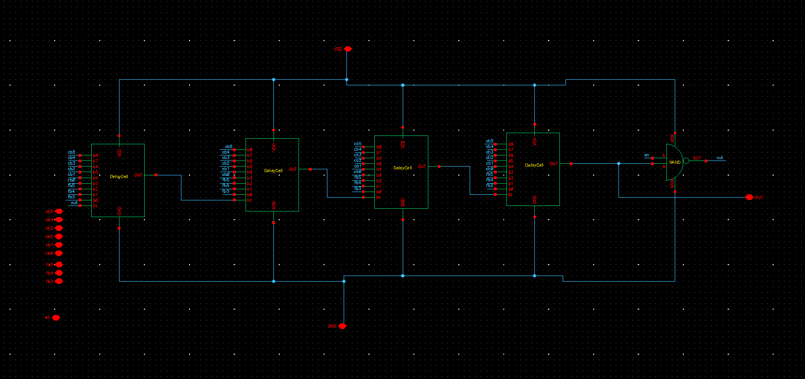
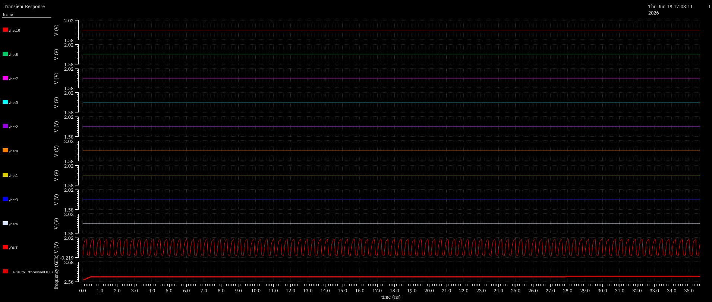
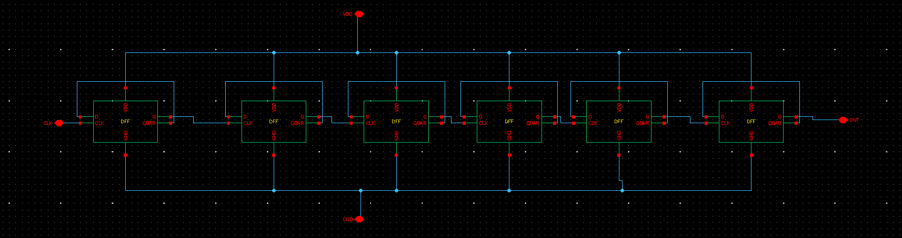
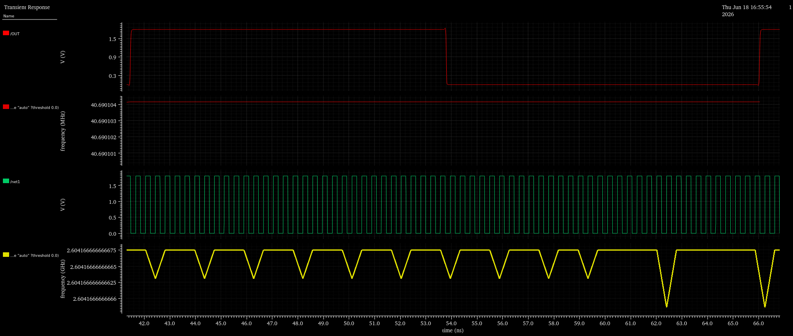
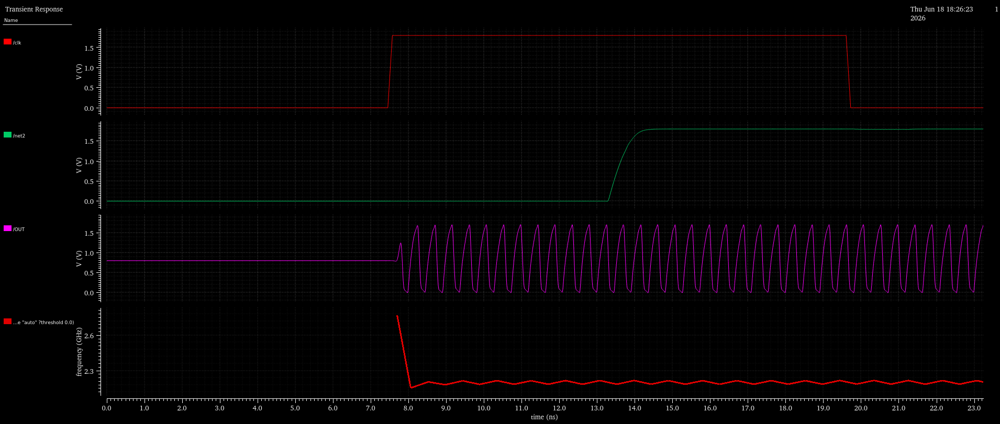

# AI/ML-Based Digital Loop Filter Design for a 2.26 GHz All-Digital Phase-Locked Loop in UMC 180nm

An All-Digital Phase-Locked Loop (ADPLL) implemented in UMC 180nm CMOS, featuring a 
25th-order FIR digital loop filter whose coefficients are trained using an Artificial 
Neural Network (ANN) instead of a conventional fixed-coefficient design.

---

## Introduction

An ADPLL replaces the conventional analog charge-pump and voltage-controlled oscillator of a 
traditional PLL with fully digital counterparts, enabling better portability across process 
nodes, superior scalability, and simplified SoC integration. This project focuses on the design 
and implementation of an ADPLL in UMC 180nm technology, with a primary emphasis on integrating 
a machine-learning-based design methodology for the digital loop filter.

The complete signal chain comprises a **Time-to-Digital Converter (TDC)**, a **Digital Loop 
Filter**, a **Digitally Controlled Oscillator (DCO)**, and a **Frequency Divider**. Rather than 
a conventional fixed-coefficient design, the digital loop filter is realized as a 25th-order FIR 
low-pass filter whose coefficients are generated by an ANN trained on a synthetic square-wave 
signal, using a hybrid zero/window-function weight-initialization strategy. The trained filter 
was synthesized in Verilog, functionally verified in Xilinx Vivado, and integrated into the 
analog/mixed-signal ADPLL environment via a Verilog-A behavioural model populated with the 
ML-derived coefficients.

**The design achieves a lock time of 8 ns, a TDC resolution of 100 ps, a DCO output frequency of 
2.26 GHz, and consumes 5.3 mW of power.**



---

## System Architecture

The reference clock (`REF_CLK`) and feedback clock (`FB_CLK`, derived from the divided DCO 
output) are compared in the digital domain:

`REF_CLK`, `FB_CLK` → **TDC** → 4-bit phase-error code → **Digital Loop Filter** → 9-bit tuning 
word → **DCO** → output clock (2.26 GHz) → **Frequency Divider** (÷64) → `FB_CLK` (closes the loop)

This entirely digital processing loop eliminates the need for analog capacitors and charge pumps.

| Block | Implementation |
|---|---|
| TDC | Transistor-level, UMC 180nm, Cadence Virtuoso |
| Digital Loop Filter | ANN-trained coefficients, Verilog RTL, Verilog-A behavioural model |
| DCO | Transistor-level 4-stage ring oscillator, UMC 180nm |
| Frequency Divider | TSPC DFF-based, ÷64, UMC 180nm |

---

## 1. Time-to-Digital Converter (TDC)

A **delay-line TDC** architecture: the reference clock edge propagates through a chain of 
calibrated inverter/buffer stages, producing progressively delayed copies of the reference 
clock. At each tap, a D flip-flop samples the delayed signal using the feedback clock as its 
sampling clock — the fixed delay per stage sets the TDC's 100 ps resolution. The resulting 
16-bit thermometer-coded pattern is converted to a compact 4-bit binary code by a custom 16×4 
priority encoder.

- **Input:** REF_CLK, FB_CLK
- **Output:** 4-bit digital phase/time-difference code
- **Resolution:** 100 ps

Sub-blocks: `schematics/dff1.png` (sampling flip-flop), `schematics/Encoder.png` (16×4 priority encoder)




---

## 2. AI/ML-Based Digital Loop Filter

**Specification:** 25th-order FIR, low-pass, 20 MHz loop bandwidth, 4-bit input / 9-bit output.

### Why ANN-trained coefficients?
Conventional digital loop filters use fixed coefficients from classical analytical methods 
(windowing, Parks-McClellan), which lack adaptability to varying noise and bandwidth 
constraints. Training an ANN to learn coefficients directly from target passband/stopband 
specs gives a flexible, data-driven, retrainable alternative — reconfigurable without 
re-deriving closed-form coefficients.

### A. Synthetic training signal generation
Rather than training on a pre-existing labelled dataset, a synthetic **square wave** was used 
as the training input. A square wave inherently comprises a low-frequency fundamental together 
with a series of higher-frequency odd harmonics:
- The fundamental component is treated as the desired **passband** content to preserve.
- The harmonic components are treated as the **stopband** content to attenuate.

By adjusting the fundamental frequency of the training square wave, the filter's effective 
cutoff — and hence the loop bandwidth (20 MHz here) — can be reconfigured without retraining on 
a new dataset for every specification.

### B. Hybrid weight initialization
Two baseline strategies were evaluated before settling on a hybrid approach:
- **Zero initialization** — backpropagation fails to converge; symmetric zero weights prevent 
  the network from differentiating gradient updates.
- **Window-function initialization** (e.g. Hamming/Hanning) — avoids the convergence failure, 
  but the optimization stays close to its starting point and the trained filter basically 
  reproduces the seed window's response without meaningfully exploring the coefficient space.
- **Hybrid initialization (adopted)** — a subset of filter weights initialized to zero, the 
  remainder seeded from a classical window function. This avoids the stagnation of pure zero-init 
  while still letting backpropagation meaningfully explore and adapt the coefficient space. Gave 
  the best observed training convergence and frequency response.

Training was done in Python (`ml_filter_training/FIR_FILTER.ipynb`) using a synthetic square-wave 
input (`ml_filter_training/input`), producing trained weights 
(`ml_filter_training/FIR_filter_weights`) and the final 25 converged impulse-response coefficients 
(`ml_filter_training/adpll_loop_filter_coeffs`).



### C. RTL implementation and verification
The 25 converged coefficients were implemented as a synthesizable Verilog RTL module 
(`rtl/fir_filter.v`) following a standard tapped delay-line FIR architecture: the 4-bit phase-error 
input is shifted through a chain of registers, multiplied by the corresponding trained coefficient 
at each tap, and accumulated via multiply-accumulate (MAC) operations to produce the 9-bit 
filtered tuning word. Functionally verified in **Xilinx Vivado** using `rtl/tb.v` to confirm 
correct tap-indexing, MAC behaviour, and overall filter response.



---

## 3. Digitally Controlled Oscillator (DCO)

Replaces the conventional VCO. A **4-stage ring-oscillator** architecture, each delay cell built 
from a digitally switched PMOS/NMOS transistor array (`schematics/DELAY_CELL.png`); the tuning 
word selectively enables individual transistor branches, varying drive strength — and hence 
propagation delay — of each cell. A closing NAND gate sustains oscillation and buffers the output.

| Parameter | Value |
|---|---|
| Input width | 9 bits |
| Tuning range | 2.20 GHz – 2.66 GHz |
| DCO gain (Kdco) | 900 kHz/bit |

Characterized through a control-word-sweep simulation methodology in Cadence Virtuoso.




---

## 4. Frequency Divider

To divide the high-frequency 2.26 GHz DCO output, a **True Single-Phase Clock (TSPC)** D-Flip-Flop 
architecture was used (`schematics/TSPC_DFF.png`) rather than a conventional master-slave DFF — 
TSPC's single-phase clock and compact 11-transistor-per-stage count better suit high-speed 
division at GHz frequencies. Six TSPC stages are cascaded for a ÷64 division ratio, with the 
resulting feedback clock closing the ADPLL loop back to the TDC.




---

## 5. Mixed-Signal Integration

Bridging the Verilog-based digital FIR filter with the transistor-level analog blocks required a 
robust mixed-signal integration strategy. Of the approaches considered, a **Verilog-A behavioural 
model** (`verilog_a/FIR_FILTER.va`), instantiated directly within the Cadence Virtuoso schematic 
environment, provided the most reliable way to achieve fully closed-loop integration.

- The 25 ANN-derived coefficients were entered directly into the Verilog-A model.
- The module's port interface was restructured to use single-bit input/output pins, wiring 
  directly to the TDC's 4-bit output and the DCO's 9-bit tuning-word input.
- Co-simulated with the transistor-level TDC, DCO, and Frequency Divider using **Cadence 
  Spectre/AMS Designer**, enabling full closed-loop ADPLL simulation and yielding the final 
  reported results.




---

## Results

### ADPLL Performance Specifications

| Parameter | Value |
|---|---|
| Technology node | UMC 180 nm |
| Supply voltage | 1.8 V |
| TDC architecture | Delay-line, 16-tap |
| TDC resolution | 100 ps |
| Digital loop filter | FIR, 25th order (ANN-trained) |
| Loop filter I/O width | 4-bit / 9-bit |
| DCO architecture | 4-stage ring oscillator |
| DCO output frequency | 2.26 GHz |
| DCO tuning range | 2.20 – 2.66 GHz |
| DCO gain (Kdco) | 900 kHz/bit |
| Frequency divider architecture | TSPC, 6 cascaded stages |
| Frequency divider ratio | ÷64 |
| Loop bandwidth | 20 MHz |
| Lock time | 8 ns |
| Power consumption | 5.3 mW |

### Comparison with existing 180nm-class ADPLL designs

| Parameter | This Work | Chung & Wei | R *et al.* | Sahani *et al.* |
|---|---|---|---|---|
| Technology | UMC 180 nm | TSMC 0.18 µm | 180 nm | 180 nm SCL |
| Loop filter | ANN-trained FIR (25th order) | Fixed-coeff. digital PI | Counter-based | Dual-loop digital |
| Output freq. | 2.26 GHz | 87–250 MHz | 4.7 GHz | 1.6 GHz |
| Lock time | 8 ns | 50 ref. cycles | 50 ps* | 1 µs |
| Power | 5.3 mW | 5.4 mW | 26 mW | 6.5 mW |
| TDC resolution | 100 ps | N/A | N/A | 6 ps |

\* *R et al.'s 50 ps figure is a DCO delay-cell propagation delay, not a loop settling time — not 
directly comparable to the 8 ns closed-loop lock time reported here.*

A fifth design, Lin & Yang's dynamic-loop-bandwidth ADPLL (0.18 µm CMOS, 1.25 GHz output, 35 mW), 
is discussed but omitted from the table. Relative to it, this design consumes roughly 6.6× less 
power at a comparable output frequency class.

**Takeaway:** the proposed ANN-trained FIR-filter ADPLL achieves a favorable balance of output 
frequency, lock time, and power consumption relative to prior 180nm-class ADPLL designs, while 
additionally offering a retrainable, data-driven loop filter not present in any of the compared 
works.

---

## Repository Structure

```
├── ml_filter_training/
│   ├── FIR_FILTER.ipynb          # ANN training notebook (Google Colab)
│   ├── input                     # Synthetic square-wave training signal
│   ├── FIR_filter_weights.xlsx   # Trained weights
│   └── adpll_loop_filter_coeffs  # Final 25 FIR coefficients
├── rtl/
│   ├── fir_filter.v               # Synthesizable Verilog FIR filter
│   └── tb.v                       # Testbench (Vivado)
├── verilog_a/
│   └── FIR_FILTER.va              # Behavioural model used in Cadence
├── schematics/
│   ├── ADPLL.png                  # Full integrated schematic
│   ├── TDC.png
│   ├── dff1.png
│   ├── Encoder.png
│   ├── DCO.png
│   ├── DELAY_CELL.png
│   ├── Freq_DIV.png
│   └── TSPC_DFF.png
└── waveforms/
    ├── TDC_OUTPUT.png
    ├── FIR_ML_OUTPUT.png
    ├── FIR_RTL_OUTPUT.png
    ├── DCO_OUTPUT.png
    ├── Freq_DIV_OUTPUT.png
    └── ADPLL_OUTPUT.png
```
## How to Reproduce

1. **Retrain filter coefficients:** open `ml_filter_training/FIR_FILTER.ipynb` in Google Colab, 
   adjust the square-wave fundamental frequency for the desired cutoff, run all cells.
2. **Verify FIR filter in Vivado:** load `rtl/fir_filter.v` and `rtl/tb.v` into Vivado, run 
   behavioural simulation.
3. **Cadence integration:** requires access to the UMC 180nm PDK (not included here). Instantiate 
   `verilog_a/FIR_FILTER.va` as a symbol, wire to transistor-level TDC/DCO/divider, simulate with 
   Spectre/AMS Designer.

---

## Applications

- Clock generation/frequency synthesis in SoC design
- Clock and Data Recovery (CDR) in high-speed SerDes links
- Wireless transceiver frequency synthesizers
- Processor clock generation with dynamic frequency scaling
- Adaptive/cognitive clocking with retrainable loop filters
- Educational/research platform for AI/ML-assisted mixed-signal IC design

---

## Future Work

- Explore a **Verilog-AMS co-simulation** flow as an alternative integration methodology.
- Carry the complete ADPLL through to full **physical layout (GDSII)** for post-layout 
  verification and tape-out readiness.

---

## References

1. Y.-M. Chung and C.-L. Wei, "An All-Digital Phase-Locked Loop for Digital Power Management 
   Integrated Chips," National Cheng Kung University, Taiwan.
2. S. Zahoor and S. Naseem, "Design and implementation of an efficient FIR digital filter," 
   *Cogent Engineering*, vol. 4, no. 1, p. 1323373, 2017.
3. D. A. Alwahab, D. R. Zaghar, S. Laki, "FIR Filter Design Based Neural Network," ELTE Eötvös 
   Loránd University / Almostansyriya University.
4. K. Baek, "Design of All-Digital Phase-Locked Loop with Supply Noise-Insensitive Ring 
   Oscillator," M.S. Thesis, Seoul National University, Feb. 2023.
5. N. Ahmad and K. Y. Lee, "Design and implementation of a low-area reconfigurable and 
   synthesizable digital loop filter for ADPLL," Sungkyunkwan University, South Korea.
6. R. Dinesh and R. Marimuthu, "An analysis of ADPLL applications in various fields," *Indonesian 
   J. Electrical Eng. and Computer Science*, vol. 18, no. 2, pp. 856–866, May 2020.
7. A. A. Gavankar, "A Digital Loop Filter for an All-Digital Phase-Locked Loop," Project Report, 
   California State University, Sacramento, Fall 2017.
8. Z. Tibenszky, C. Carta, F. Ellinger, "A 0.35 mW 70 GHz Divide-by-4 TSPC Frequency Divider on 
   22 nm FD-SOI CMOS Technology," TU Dresden.
9. S. R, J. Manjula, A. Ruhan Bevi, "Design of All Digital Phase Locked Loop for Wireless 
   Applications," *International Journal of Engineering and Technology*, vol. 7, no. 3.12, 
   pp. 167–170, 2018.
10. J. K. Sahani, A. Singh, A. Agarwal, "A 1 µs Locking Time Dual Loop ADPLL with Foreground 
    Calibration-Based 6 ps Resolution Flash TDC in 180 nm CMOS," *Circuits, Systems, and Signal 
    Processing*, vol. 41, pp. 1299–1323, 2022.
11. J.-M. Lin and C.-Y. Yang, "A Fast-Locking All-Digital Phase-Locked Loop With Dynamic Loop 
    Bandwidth Adjustment," *IEEE Trans. Circuits and Systems I*, vol. 62, no. 10, pp. 2411–2422, 
    Oct. 2015.
12. P. Sreehari, P. Devulapalli, D. Kewale, O. Asbe, K. S. R. Krishna Prasad, "Power Optimized PLL 
    Implementation in 180 nm CMOS Technology," NIT Warangal, 2014.
13. A. Agrawal and R. Khatri, "Design of Low Power, High Gain PLL using CS-VCO on 180 nm 
    Technology," *International Journal of Computer Applications*, vol. 122, no. 18, pp. 26–31, 
    July 2015.

> **Authors:** Sanga Vignesh, Gone Harthika
> **Guided by:** Prof. Patri Sreehari Rao, Unnam Anitha, Nagulla Subbarao — NIT Warangal
>
> Sponsored by the Ministry of Electronics and Information Technology (MeitY), Government of 
> India, under the Chips to Startup (C2S) Programme.

## License

This project is licensed under the MIT License — see [LICENSE](LICENSE) for details.
